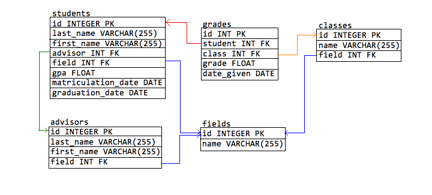

# Math PhD Students Database for Hackett University

This is a Ruby program that uses persistent data to organize data pertaining to Math PhD candidates and recipients of Hackett University. It is intended to be used as a data entry and retrieval system to keep track of the students' names, advisors, specialty, grades, etc.

(Yes, that is a school name generated by the Faker Ruby gem.)

## Database Schema

## Features

View, update, and add information to students, advisors, classes, grades, fields (of math).

#### Caveats

   * If you do not enter a date of matriculation when entering data for a new student, it will automatically put the current day's date.
   * A student's GPA should not be updated manually, since will be calculated automatically by the data contained in the grades table.
   * A student's date of graduation should not be updated manually. Graduate students at Hackett University are marked as "graduated" automatically once they have taken 8 graduate classes.

## File Navigation

Under Construction